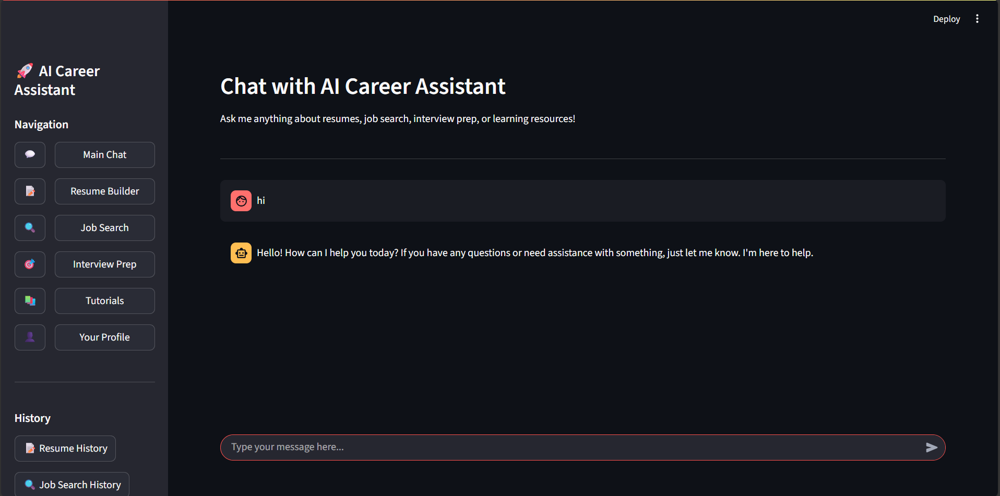
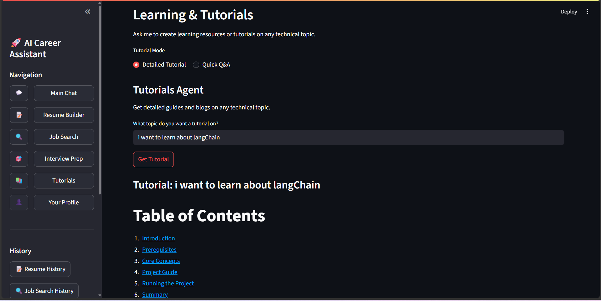
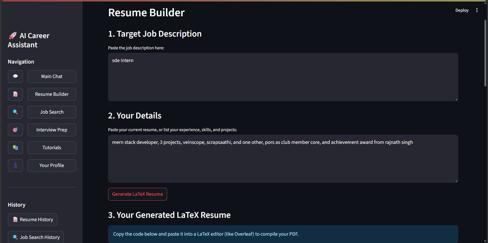
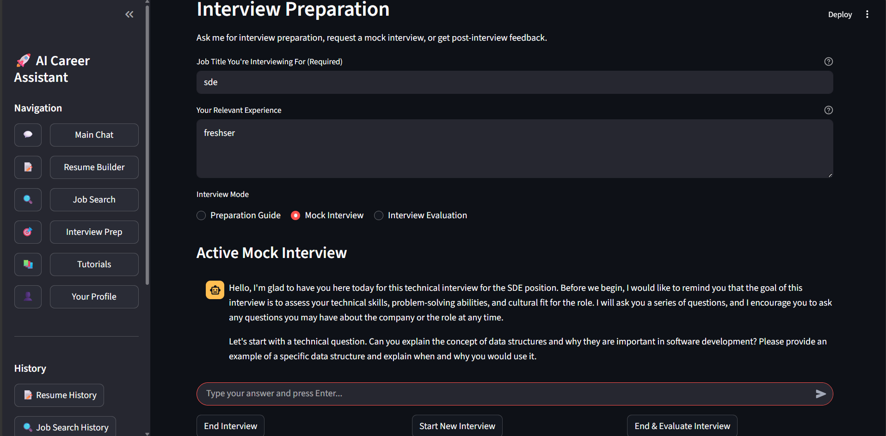
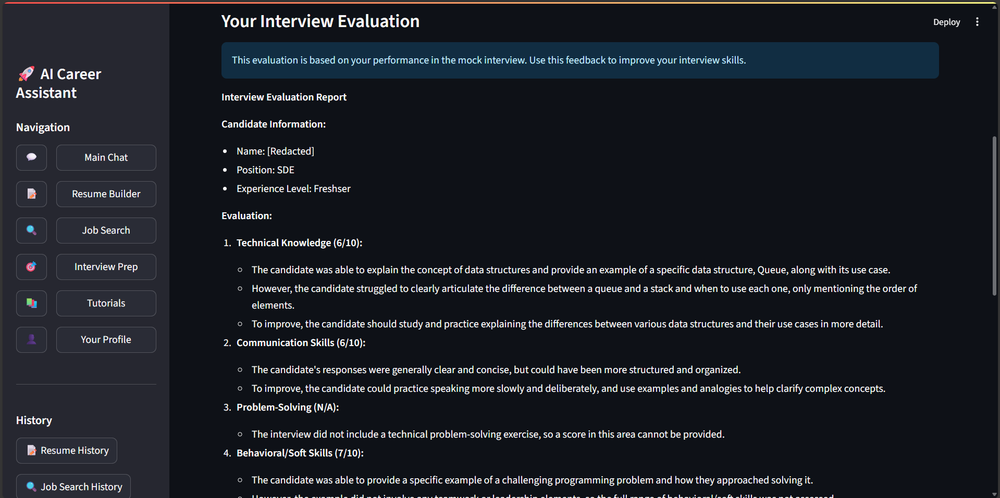
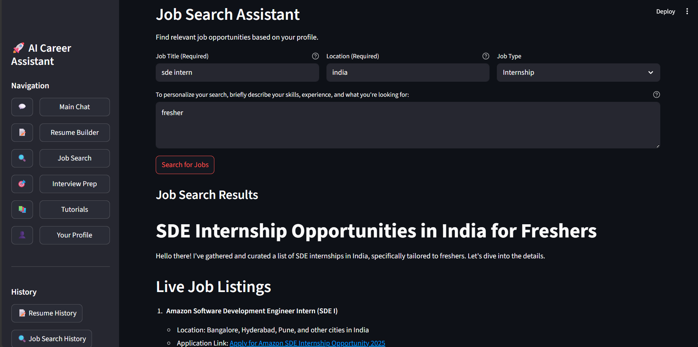

# GenAI Career Assistant Agent 🚀

<div align="center">
  
</div>

## Overview

The **GenAI Career Assistant** is an advanced AI-powered career platform designed to revolutionize your journey in **Generative AI learning, resume preparation, interview readiness, and job hunting**. Built with sophisticated agent architecture, it offers personalized guidance at every step of your career path.

### Tech Stack

- **100% Open Source Technologies**
- **Framework**: LangChain, LangGraph
- **LLM Integration**: Together AI (Mixtral, other models)
- **Search Capabilities**: DuckDuckGo Search API
- **UI**: Streamlit

<!-- <div align="center">
  
</div> -->

## Motivation

As Generative AI rapidly evolves, professionals face significant challenges:

- Overwhelming volume of learning resources with varying quality
- Difficulty finding up-to-date materials as frameworks evolve weekly
- Time-consuming process of filtering through lengthy videos and tutorials
- Frustration with deprecated code examples from general AI assistants
- Uncertainty about which skills to prioritize for career advancement

The **GenAI Career Assistant** solves these problems by providing a **centralized, continuously updated platform** tailored specifically to GenAI career development.

## Key Features

<div align="center">
  
</div>

### 1. Learning & Content Creation
- **Personalized Learning Paths**: Custom tutorials on GenAI topics aligned with your experience level
- **Up-To-Date Materials**: Real-time search integration ensures current information
- **Practical Examples**: Emphasis on working code and implementation details

### 2. Resume Engineering
- **AI-Optimized Resumes**: LaTeX-formatted documents tailored to specific job descriptions
- **ATS Optimization**: Strategic keyword placement to maximize visibility
- **Professional Formatting**: Clean, structured layouts that highlight your GenAI expertise

<div align="center">
  
</div>

### 3. Interview Preparation
- **Comprehensive Preparation Guides**: Curated resources for technical and behavioral questions
- **Mock Interview Simulation**: Realistic practice with personalized feedback
- **Performance Analytics**: Detailed scoring and improvement recommendations

<div align="center">
  
</div>
<div align="center">
  
</div>

### 4. Strategic Job Search
- **Real-Time Opportunity Discovery**: Live job aggregation from across the web
- **Personalized Recommendations**: Matching based on your skills and preferences
- **Application Strategy**: Timing and approach recommendations to maximize success

<div align="center">
  
</div>

## System Architecture

The system employs a sophisticated **agent-based architecture**:

1. **State Management**: Using `TypedDict` to track the state of each user interaction
2. **Query Categorization**: Intelligent routing of requests to specialized agents
3. **Sub-Categorization**: Further refinement of request type (Tutorial/Q&A, Interview Prep/Mock Interview)
4. **Response Generation**: Creating appropriate, contextually relevant outputs
5. **Workflow Graph**: LangGraph-powered flexible and extensible workflow

<!-- <div align="center">
  
</div> -->

## Getting Started

### Prerequisites

- Python 3.8+
- Together AI API key (obtain from [https://www.together.ai](https://www.together.ai/))

### Installation

```bash
# Clone the repository
git clone https://github.com/yourusername/genai-career-assistant.git
cd genai-career-assistant

# Install dependencies
pip install -r requirements.txt

# Set up environment variables
echo "TOGETHER_API_KEY=your_api_key_here" > .env
```

### Launch the Application

```bash
streamlit run main.py
```

---


## 📒 Usage Guide

The interface supports multiple interaction modes:

- **Guided Mode**: Navigate through purpose-built tabs for learning, resume creation, interviews, and job search.
- **Conversational Mode**: Ask the assistant questions in natural language (e.g., "Create a resume for a GenAI prompt engineer").
- **Custom Mode**: Provide specific JSON configurations or preferences to customize resume, blog, or job queries.

---

## 🚀 Future Roadmap

- 🎤 **Voice Interface**: Multimodal interaction with voice input and output.
- 📚 **Expanded Domain Coverage**: Specialized agents for Data Science, ML Engineering, and AI Ethics.
- 🧠 **Adaptive Learning Paths**: Personalized curricula based on user’s progress, assessment, and goals.
- 🏢 **Enterprise Integration**: SSO, user analytics, and admin dashboards for organizations and bootcamps.
- 🧩 **Plugin Ecosystem**: User-contributed plugins to extend functionality.

---

## 🤝 Contribution

We welcome contributions from the community! Here's how you can help:

- ⭐ Star the project to show support and increase visibility.
- 🐛 Report bugs or suggest features via GitHub Issues.
- 📂 Fork the repository and submit pull requests with improvements or new features.
- ✨ Follow conventional commit messages and include test cases when relevant.

> Let’s build the future of GenAI careers together!

---

## License

This project is licensed under the MIT License - see the [LICENSE](LICENSE) file for details.

---

<div align="center">
  <strong>Empower your GenAI journey with clarity and confidence 🚀</strong>
</div>
